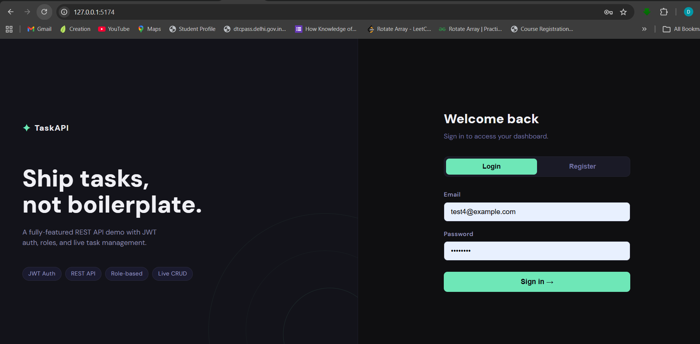
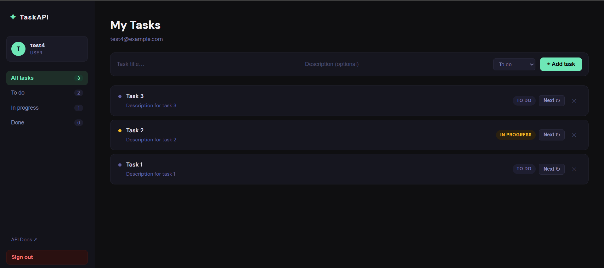
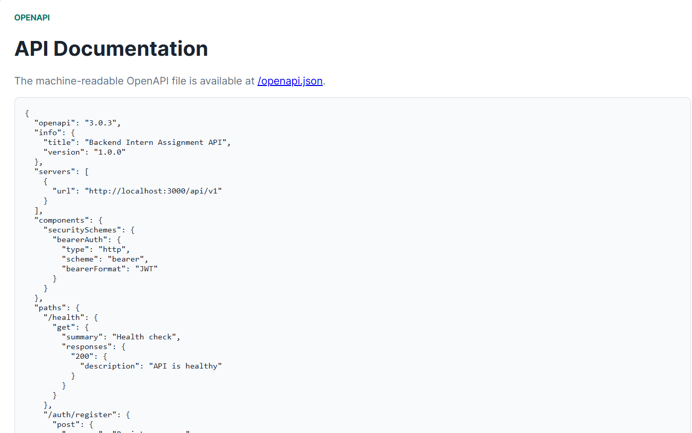

# Backend Developer Intern Assignment

A full-stack task management application demonstrating secure backend development, JWT authentication, role-based access control, REST API design, frontend integration, API documentation, and deployment readiness.

## Features

### Backend

* JWT Authentication & Authorization
* PBKDF2 Password Hashing with per-user salts
* Role-Based Access Control (User/Admin)
* Versioned REST API (`/api/v1`)
* Tasks CRUD Operations
* Request Validation & Error Handling
* OpenAPI Documentation
* PostgreSQL Schema
* Modular & Scalable Architecture

### Frontend

* React + Vite
* User Registration & Login
* Protected Dashboard
* Task Management (Create, Read, Update, Delete)
* Success & Error Notifications
* Responsive UI

---

## Project Structure

```text
.
├── backend/
│   ├── src/
│   ├── db/
│   ├── docs/
│   └── tests/
│
├── frontend/
│   ├── src/
│   └── public/
│
├── docker-compose.yml
└── README.md
```

---

## Screenshots

### Authentication



### Dashboard



### API Documentation



---

## Local Setup

### Backend

```bash
cd backend
npm install
npm start
```

Backend URLs:

| Resource     | URL                                 |
| ------------ | ----------------------------------- |
| API Root     | http://localhost:3000               |
| Health Check | http://localhost:3000/api/v1/health |
| API Docs     | http://localhost:3000/docs          |
| OpenAPI JSON | http://localhost:3000/openapi.json  |

### Seeded Admin Account

```text
Email: admin@example.com
Password: Admin@12345
```

---

### Frontend

```bash
cd frontend
npm install
npm run dev
```

Frontend URL:

```text
http://localhost:5174
```

---

## Docker Setup

Build and run the complete application:

```bash
docker compose up --build
```

Stop containers:

```bash
docker compose down
```

---

## Quick Scripts

From the project root:

```bash
npm run backend
npm run backend:test
npm run frontend
```

---

## API Summary

All endpoints are versioned under:

```text
/api/v1
```

| Method | Route          | Access        | Description   |
| ------ | -------------- | ------------- | ------------- |
| GET    | /health        | Public        | Health Check  |
| POST   | /auth/register | Public        | Register User |
| POST   | /auth/login    | Public        | Login         |
| GET    | /auth/me       | Authenticated | Current User  |
| GET    | /users         | Admin         | List Users    |
| GET    | /tasks         | Authenticated | List Tasks    |
| POST   | /tasks         | Authenticated | Create Task   |
| GET    | /tasks/:id     | Owner/Admin   | Get Task      |
| PATCH  | /tasks/:id     | Owner/Admin   | Update Task   |
| DELETE | /tasks/:id     | Owner/Admin   | Delete Task   |

---

## Example Requests

### Register

```bash
curl -X POST http://localhost:3000/api/v1/auth/register \
-H "Content-Type: application/json" \
-d '{"name":"Dev User","email":"dev@example.com","password":"Password@123"}'
```

### Login

```bash
curl -X POST http://localhost:3000/api/v1/auth/login \
-H "Content-Type: application/json" \
-d '{"email":"dev@example.com","password":"Password@123"}'
```

### Create Task

```bash
curl -X POST http://localhost:3000/api/v1/tasks \
-H "Authorization: Bearer YOUR_TOKEN" \
-H "Content-Type: application/json" \
-d '{"title":"Build API","description":"Finish assignment","status":"todo"}'
```

---

## Database Design

The application currently uses a lightweight JSON repository for easy evaluation without requiring database installation.

A production-ready PostgreSQL schema is provided in:

```text
backend/db/schema.sql
```

The repository layer is isolated and can be replaced with PostgreSQL, MySQL, or MongoDB without modifying route handlers or business logic.

---

## Scalability Considerations

The backend follows a modular architecture:

```text
config
middleware
repositories
routes
utilities
docs
tests
```

For production-scale deployments:

* Replace JSON storage with PostgreSQL
* Deploy behind a load balancer
* Use Redis for caching and rate limiting
* Add structured logging and monitoring
* Implement CI/CD pipelines
* Scale backend instances horizontally
* Separate services only when traffic or ownership requires it

---

## Security

* PBKDF2 Password Hashing
* Per-user Salts
* JWT Authentication
* Role-Based Authorization
* Request Validation
* Consistent Error Responses
* Protected Routes
* Input Sanitization

Production recommendations:

* HTTPS Everywhere
* Strong JWT Secret
* Secure HTTP-only Cookies
* Centralized Secrets Management
* Rate Limiting
* Audit Logging

---

## Tech Stack

### Backend

* Node.js
* Native HTTP Server
* JWT
* OpenAPI 3.0

### Frontend

* React 19
* Vite

### Database

* PostgreSQL Schema
* JSON Repository (Development)

### Deployment

* Docker
* Docker Compose

---

## Assignment Requirements Coverage

| Requirement                 | Status |
| --------------------------- | ------ |
| User Registration & Login   | ✅      |
| Password Hashing            | ✅      |
| JWT Authentication          | ✅      |
| Role-Based Access Control   | ✅      |
| CRUD APIs                   | ✅      |
| API Versioning              | ✅      |
| Validation & Error Handling | ✅      |
| API Documentation           | ✅      |
| Database Schema             | ✅      |
| Frontend Integration        | ✅      |
| Protected Dashboard         | ✅      |
| Scalability Note            | ✅      |
| Docker Support              | ✅      |

---

Built as part of the Backend Developer Intern Assignment.
